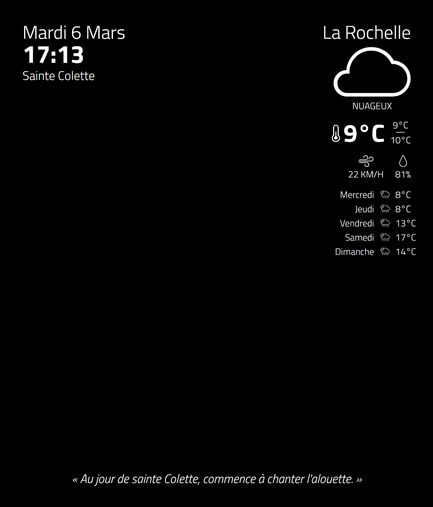

# MagicMirror

## Installation

Clone the repository :

	git clone https://github.com/TimVaraillas/MagicMirror.git

Install the dependencies:

	cd MagicMirror && npm install

## Development server

Run the development server :

	ng serve

Navigate to `http://localhost:4444/` to access the MagicMirror app from your browser

## OpenWeatherMap API

To get weather forecast data, visit `https://www.openweathermap.org/`, create an account and generate your API key. Next, open `src/app/app.service.ts` and edit the following line by entering your API key :

	private apiKey = 'yourAPIkey'

## Screenshot

